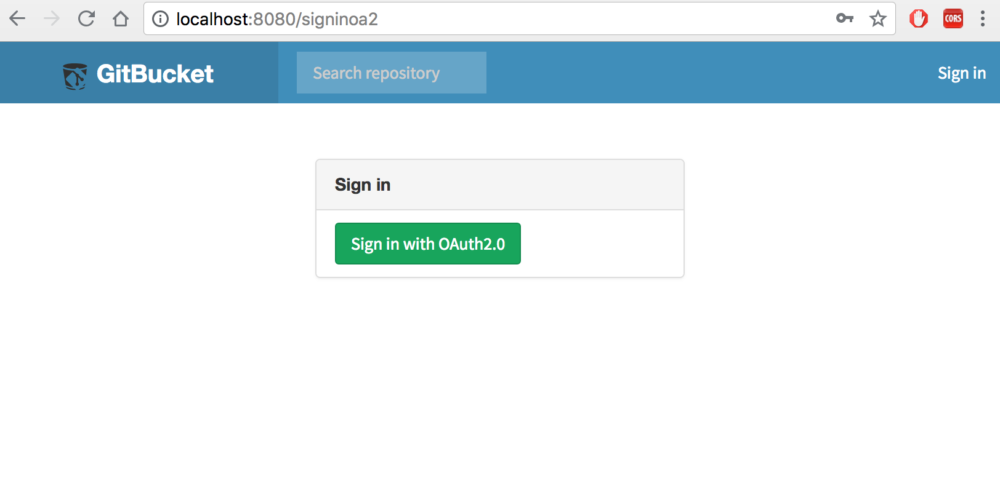

gitbucket-oauth2-plugin
========

## Installation
Run `sbt assembly` and copy generated `/target/scala-2.12/gitbucket-oauth2-plugin_2.12-1.0.0.jar` to `~/.gitbucket/plugins/` (If the directory does not exist, create it by hand before copying the jar), or just run `sbt install`.

Then start GitBucket and login as admin, access to http://localhost:8080/admin/oa2 in your web browser, input OAuth2.0 settings.

Then logout and access to http://localhost:8080/signinoa2 in your web browser, you will see OAuth2.0 login screen.

## Custom supported scope
Defaulst scope is fixed as "email+profile". Please modify "OA2_SCOPE" valiable at "OA2Service.scala" by yourself.
